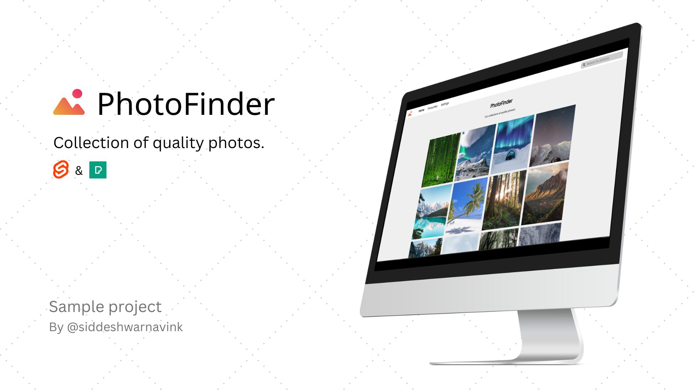

# PhotoFinder
A collection of quality photo




## Getting started

Install the dependencies...

```bash
cd svelte-app
npm install
```

...then start [Rollup](https://rollupjs.org):

```bash
npm run dev
```

Navigate to [localhost:8080](http://localhost:8080).

## Contributing Content
Edit and fix the sit. Feel free to submit PRs for small issues. For large issues or features open an issue first.

First, fork this repo on Github.

```
git clone <your-forked-repo>
npm install
npm run dev

git checkout -b my-fix
```

## Fix some code
Find something wrong which is need to be fixed?  Make the changes in a branch and run the following code:

```
git commit -m "fix: corrected a typo"
git push origin my-fix
```
